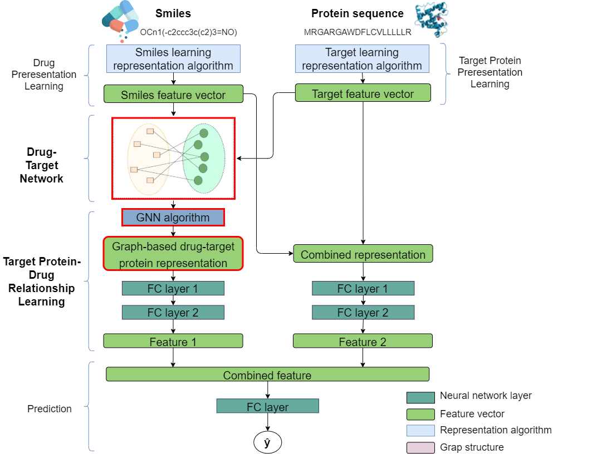

<div align="center">
  
# SG-DTA: Stacked Graph Drug-Target Association

</div>

**Note (2021-17-10)**: We will public the dataset for this repository after our research is accepted.

### Table of contents
1. [Prerequisites](#1-prerequisites)
2. [Install](#2-install)
3. [Getting started](#3-getting-started)
4. [Results](#4-results)
<!-- 5. [Citation](#5-Citation) -->

### 1. Prerequisites
- [**Python==3.8.0**](https://www.python.org/) is required will all installed including [**PyTorch==1.7**](https://pytorch.org/get-started/previous-versions/) with CUDA 11.0 (When you run with other verions, the results might be slightly different).
- [**Pytorch Geometric**](https://pytorch-geometric.readthedocs.io/en/latest/notes/installation.html) for Pytorch: Please match the device used when installing.
- [**rdkit==2020.09.1**](https://github.com/rdkit/rdkit): Generate the compound network.
- Other dependencies are described in [requirements.txt](https://github.com/ultralytics/yolov5/blob/master/requirements.txt) installed including

### 2. Install
- Creating conda environment for the experiment:
```bash
conda create -n sgdta python=3.8.11 -y
conda activate sgdta
```
- Installing PyTorch, Torchvision and Pytorch Geometric depending on the device you use to run the experiment:  
The following setting, we config environment for CPU and GPU device with Pytorch == 1.7.0, CUDA 11.0.

**For CPU version**
```bash
pip install torch==1.7.0+cu110 torchvision==0.8.0+cu110 torchaudio==0.7.0 -f 
pip install torch-scatter -f https://pytorch-geometric.com/whl/torch-1.7.0+cpu.html
pip install torch-sparse -f https://pytorch-geometric.com/whl/torch-1.7.0+cpu.html
pip install torch-cluster -f https://pytorch-geometric.com/whl/torch-1.7.0+cpu.html
pip install torch-spline-conv -f https://pytorch-geometric.com/whl/torch-1.7.0+cpu.html
pip install torch-geometric==1.6.3 --use-feature=2020-resolver
```

**For GPU version**
```bash
pip install pytorch==1.7.0 torchvision==0.8.0 torchaudio==0.7.0 cudatoolkit=11.0 -c pytorch
pip install torch-scatter -f https://pytorch-geometric.com/whl/torch-1.7.0+cu110.html
pip install torch-sparse -f https://pytorch-geometric.com/whl/torch-1.7.0+cu110.html
pip install torch-cluster -f https://pytorch-geometric.com/whl/torch-1.7.0+cu110.html
pip install torch-spline-conv -f https://pytorch-geometric.com/whl/torch-1.7.0+cu110.html
pip install torch-geometric==1.6.3 --use-feature=2020-resolver
```

- Installing **rdkit** and other dependencies:
```bash
conda install -y -c conda-forge rdkit==2020.09.1
pip install -r req.txt
```

### 3. Getting started
#### Setting Datasets
(We will release soon)

#### Training and Evaluation
- Training command line:
  ```bash
  python main.py train --train_fold ${fold} --dataset ${dataset} --drug_embedding ${drug_model} --protein_embedding ${protein_model} --network_embedding ${node_embedding_model} --model ${model} --data_type ${data_type} --exp_name ${experiment_name}
  ```
  Please go through file [main.py](https://github.com/CuongVoThanh/SG-DTA/blob/master/main.py#L10) to see the detail information of all parameters.

  - Training a model from scratch:
    
    For example, 
    
    To train model GraphDTA with all KIBA data training and use gat-gcn for drug embedding:
    ```bash
    python main.py train --train_fold 6 --dataset kiba --drug_embedding gat_gcn --protein_embedding embedding --model graphdta --model_data dataDTA --exp_name "Graph_kiba_gat_gcn"
    ```
    To train model SG-DTA with all KIBA data training, and gat-gcn for drug embedding, CNN for target protein, GCN for drug-target network:
    ```bash
    python main.py train --train_fold 6 --dataset kiba --drug_embedding gat_gcn --protein_embedding embedding --model graphdta --network_embedding gcn --model_data dataDTA --exp_name "SGDTA_kiba_gat_gcn_GCN"
    ```

  - Training a model using pretrained_weight: Please config the "exp_name" equivalently to the folder name downloaded from google drive.
    
    For example,
    
    To train model GraphDTA with all KIBA data and gat_gcn for drug embedding using pretrained "Graph_kiba_gat_gcn"
    ```bash
    python main.py train --resume_fold 6  --dataset kiba --drug_embedding gat_gcn --protein_embedding embedding --model graphdta --data_type dataDTA --exp_name "Graph_kiba_gat_gcn"
    ```
    To train model SG-DTA with all KIBA data and gat-gcn for drug embedding, CNN for target protein, GCN for drug-target network
    ```bash
    python main.py train --resume_fold 6 --dataset kiba --drug_embedding gat_gcn --protein_embedding embedding --model graphdta --network_embedding gcn --model_data dataDTA --exp_name "SGDTA_kiba_gat_gcn_GCN"
    ```

- Evaluating command line:
  ```bash
  python main.py test --test_on_fold ${fold} --dataset {dataset} --drug_embedding ${drug_model} --protein_embedding ${protein_model} --network_embedding ${node_embedding_model} --model ${model} --data_type dataDTA --exp_name ${experiment_name}
  ```
  
  In order to evaluate model, setting consistently the "exp_name" equivalently to the folder name of trained model.
  
  For example,
  
  To evaluate DeepDTA model with DAVIS dataset, and CNN for drug_embedding,  CCN for protein_embedding:
  ```bash
  python main.py test --test_on_fold 6 --dataset davis --graph_embedding embedding --protein_embedding embeddingdeep --network_embedding gcn --model deepdta --data_type dataDTA --exp_name "Deep_davis_fulldata"
  ```
  
  To evaluate SG-DTA model with DAVIS dataset, and CNN for drug, CNN for protein, GCN for drug_target network:
  ```bash
  python main.py test --test_on_fold 6 --dataset davis --graph_embedding embedding --protein_embedding embeddingdeep --network_embedding gcn --model sgdta --data_type dataDTA --exp_name "Deep_davis_gcn_fulldata"
  ```

### 4. Results

We use 4 evaluation metrics to perform our experiments ([evaluation_metric.py](https://github.com/CuongVoThanh/SG-DTA/blob/dev/utils/evaluation_metrics.py)) on two famous datasets Davis and Kiba. The notation ```D & T + DTN``` of architecture is the way how to represent drug, target and drug-target network feature vectors respectively. The full result and explanation of the results are reported in the paper.

#### Davis
|   Method     |  Architecture (D & T + DTN) |   MSE   | Pearson | Spearman |   CI    | 
|    :---      |     :---:                   |  :---:  |  :---:  |  :---:   |  :---:  |
| DeepDTA      | CNN & CNN                   | 0.24050 | 0.84260 | 0.69339  | 0.88618 | 
| SG-DTA (our) | CNN & CNN + GAT-GCN         | 0.21762 | 0.85495 | 0.70868  | 0.89600 |
| GraphDTA     | GIN & CNN                   | 0.22818 | 0.84649 | 0.70839  | 0.89580 | 
| SG-DTA (our) | GIN & CNN + GAT             | 0.21936 | 0.85246 | 0.71903  | 0.90192 |
| DGraphDTA    | GCN & GCN                   | 0.21238 | 0.85850 | 0.70696  | 0.89619 |
| SG-DTA (our) | GCN & GCN + GAT             | 0.20946 | 0.86081 | 0.72415  | 0.90580 |

#### Kiba
|   Method     |  Architecture (D & T + DTN) |   MSE   | Pearson | Spearman |   CI    | 
|    :---      |     :---:                   |  :---:  |  :---:  |  :---:   |  :---:  |
| DeepDTA      | CNN & CNN                   | 0.14362 | 0.88816 | 0.88181  | 0.88865 |
| SG-DTA (our) | CNN & CNN + GAT             | 0.14285 | 0.88890 | 0.88790  | 0.89549 |
| GraphDTA     | GAT-GCN & CNN               | 0.13912 | 0.89180 | 0.88389  | 0.88929 |
| SG-DTA (our) | GIN & CNN + GAT             | 0.12714 | 0.90223 | 0.89778  | 0.90211 |
| DGraphDTA    | GCN & GCN                   | 0.12608 | 0.90283 | 0.89566  | 0.90089 |
| SG-DTA (our) | GCN & GCN + GAT             | 0.12505 | 0.90375 | 0.89772  | 0.9031  |
